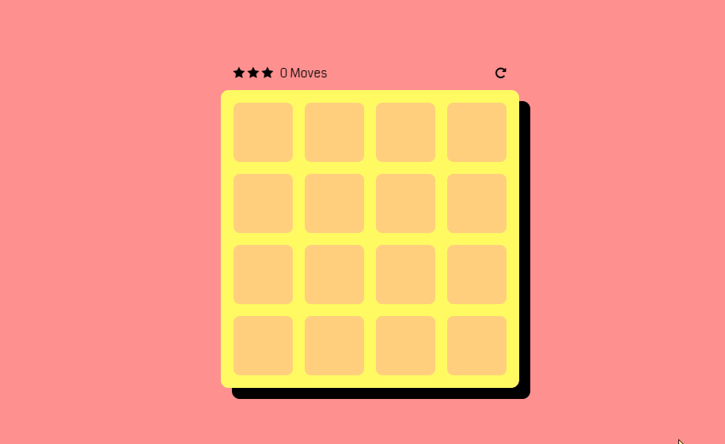

# Match-Game

## Description
This is a simple card matching game where the user tries to clear the board of all matching cards. The top scores will be shown in the high score screen. This is where you can personalize this game and you can even make a theme out of it if you'd like.

## Technologies
There are no restrictions when it comes to frontend frameworks you can use. HTML and css is fine too. I would like to see some frameworks being used so choose either material or bootstrap. Whatever you are more familiar with.
## Game Logic
In this project, you'll be creating a game matching game where you will have multiple cards with the same values. When the user selects 2 of the cards, if the cards match, then the user gets a point. If the card does not match, the cards flip back to their backside and the user gets to go again. We will be implementing a timer to countdown so the user can't be doing this infinitely. When the board is cleared, the user wins the game and the game will save it's current timer + the user's score. It will then be printed to a high score screen. A choice should be given to the user at this point as to whether they want to go to the high score screen or start a new game which will reinitialize all values + the cards.

### - Game Flow

1. The game starts with a splash screen and a button to start the game.
2. If the button is clicked a model appears to ask the user their username. (this is to recard high scores)
3. Once the name is inputed, the next scene they see is the board itself with cards instanitated. This should be up to you on how you want to instantiate this board with the cards' backside.
4. A timer starts and the user starts guessing the cards. When the click on a card, it should flip over and show the face. For every correct match they get points. If they miss decrement the time and turn the card to the backside.
5. The game ends when the board is cleared logging the user's current score + left over time or when the timer has run out with the user's current score.
6. The user is then prompted if they'd like to start again or be taken to the highscore screen to view all user's highscore.
7. If they choose to be taken to the highscore screen, grab a list of all user's and get the top 5 highest score on the screen.
8. If they choose to restart the game, then reset the board and repeat process 1-6.

## Bonus
You'll most likely be using local storage to store this information, but if you can spin up a server and use something like mongo or mysql to save this information, that would be even better since you'll be creating your own API's. I'll leave this as a bonus for now.

Ex. (Not a perfect example tho)

